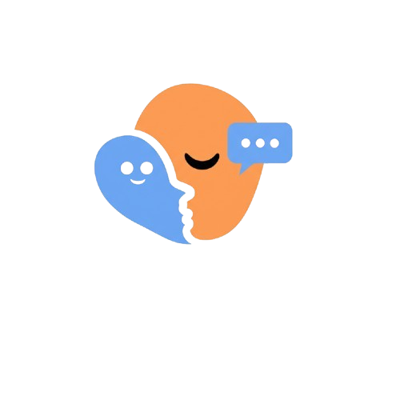

# SoulFriend - Platform Kesehatan Mental Digital

<div align="center">
  
  
  [](https://opensource.org/licenses/MIT)
  [](https://soulfriend.app)
  [](https://github.com/soulfriend-org)
</div>

## 🎯 Tentang SoulFriend

**SoulFriend** adalah platform web inovatif yang dirancang khusus untuk membantu masyarakat, terutama generasi muda, dalam memantau dan menjaga kesehatan mental mereka secara aktif setiap hari. Platform ini hadir sebagai solusi digital untuk mengatasi kurangnya pemantauan, pendampingan, dan edukasi mengenai kesehatan mental serta bahaya paparan konten negatif seperti judi online di era digital.

### 🌟 Visi & Misi

**Visi:** Menjadi platform terdepan dalam mendukung kesehatan mental masyarakat Indonesia melalui teknologi AI yang mudah diakses dan terpercaya.

**Misi:**

-   Memberikan tools pemantauan kesehatan mental yang mudah digunakan
-   Menyediakan edukasi interaktif tentang kesehatan mental dan bahaya judi online
-   Melindungi pengguna dari paparan konten berbahaya di internet
-   Membangun komunitas yang peduli terhadap kesehatan mental

## 🚨 Problem Statement

Di era digital saat ini, kita menghadapi tantangan serius:

-   **Kurangnya Pemantauan:** Minimnya tools untuk memantau kondisi kesehatan mental secara rutin
-   **Paparan Konten Berbahaya:** Generasi muda rentan terhadap konten negatif seperti judi online
-   **Keterbatasan Akses Edukasi:** Sulitnya mendapatkan informasi kesehatan mental yang mudah dipahami
-   **Perubahan Suasana Hati:** Fluktuasi mood yang tidak terpantau dapat berdampak buruk
-   **Kurangnya Pendampingan:** Minimnya akses ke konsultasi kesehatan mental yang responsif

## 🛠️ Fitur Utama

### 1. 🎭 **Mood & Condition Tracking**

-   **Facial Expression Recognition** menggunakan ResEmoteNet dan OpenCV
-   Deteksi mood/keadaan harian secara otomatis melalui kamera
-   Grafik pelacakan mood bulanan dengan visualisasi interaktif
-   Analisis pola perubahan suasana hati berbasis data historis

### 2. 🤖 **AI-Powered Companion**

-   AI menganalisis kondisi mental pengguna setiap hari menggunakan **Azure OpenAI**
-   Memberikan respon dan saran yang sesuai sebagai teman digital
-   Konsultasi kesehatan mental 24/7 dengan **Langchain** integration
-   Mode percobaan untuk pengguna baru (3x percakapan gratis)

### 3. 🛡️ **Pengecekan Link Berbahaya**

-   Sistem otomatis mendeteksi tautan judi online dan konten berbahaya
-   Peringatan real-time saat mengakses situs tidak aman
-   Database perlindungan yang terus diperbarui
-   Analisis URL dengan machine learning algorithms

### 4. 📚 **Modul Edukasi**

-   Berbagai modul dan artikel seputar kesehatan mental yang mudah diakses
-   Konten edukasi bahaya judi online (judol) dan topik terkait
-   Panduan manajemen stres dan kecemasan berbasis evidens
-   Sesi refleksi dan komitmen untuk self-improvement

### 5. 🧠 **Quiz Interaktif**

-   Quiz untuk meningkatkan pemahaman tentang kesehatan mental dan risiko konten negatif
-   Kuis bertingkat (Mudah, Medium, Sulit) dengan topik beragam
-   Sistem poin dan reward untuk meningkatkan engagement
-   Evaluasi pemahaman pengguna dengan feedback konstruktif

### 6. 🎯 **Quiz Generation**

-   **AI-powered quiz generation** menggunakan Azure OpenAI dan **Langgraph**
-   Generate quiz sesuai kondisi keadaan pengguna secara personal
-   Membantu pengguna memahami kondisi mental mereka saat ini
-   Memberikan panduan cara menghadapi situasi spesifik berdasarkan hasil quiz

## 🚀 Cara Penggunaan

### A. 🆓 **Mode Uji Coba (Tanpa Registrasi)**

1. Kunjungi website SoulFriend
2. Klik tombol **"Coba Sekarang"**
3. Masukkan nama panggilan untuk personalisasi
4. Izinkan akses kamera untuk deteksi mood
5. Mulai percakapan dengan AI Chatbot (maksimal 3x)

### B. 👤 **Mode Lengkap (Dengan Registrasi)**

#### Registrasi & Login

```
1. Klik "Sign Up" → Isi formulir pendaftaran
2. Klik "Sign In" → Masukkan kredensial
3. Akses ke Halaman Home
```

#### Fitur Harian

```
📊 Check-in Mood Harian
├── Klik "Check-in Mood Harian"
├── Izinkan akses kamera
├── Mood terdeteksi & dashboard terupdate
└── Fitur berubah menjadi "Mulai Chatbot Asisten"

🤖 Asisten AI
├── Klik "Mulai Chatbot Asisten"
├── Percakapan tanpa batas
└── Konsultasi personal 24/7
```

#### Fitur Edukasi

```
🧠 Kuis Edukasi
├── Menu "Kuis"
├── Pilih topik: Kesehatan Mental / Judi Online
├── Pilih tingkat: Mudah / Medium / Sulit
└── Dapatkan poin untuk dashboard

📖 Materi Pembelajaran
├── Menu "Materi Pembelajaran"
├── Pilih topik yang diminati
├── Baca artikel lengkap
└── Sesi Refleksi & Komitmen

🔍 Validasi Situs
├── Menu "Cek Validasi Website"
├── Paste URL yang ingin diperiksa
├── Klik "Cek"
└── Dapatkan hasil analisis keamanan
```

## 🎯 Target Pengguna

-   **Generasi Muda (16-35 tahun)** yang aktif menggunakan internet
-   **Mahasiswa dan Pekerja** yang mengalami tekanan psikologis
-   **Orang Tua** yang ingin melindungi anak dari konten berbahaya
-   **Individu** yang peduli dengan kesehatan mental pribadi
-   **Edukator dan Konselor** yang membutuhkan tools pendukung

## 🔧 Teknologi yang Digunakan

### 🎯 **AI & Machine Learning**

-   **Mood Detection:** ResEmoteNet + OpenCV untuk Facial Expression Recognition
-   **AI Analysis:** Azure OpenAI (AI Foundry) dengan Langchain integration
-   **Quiz Generation:** Azure OpenAI, Langchain, dan Langgraph
-   **Deployment:** Azure Machine Learning Endpoint

### 🖥️ **Backend Architecture**

-   **Framework:** FastAPI dengan Python
-   **Authentication:** OAuth JWT untuk keamanan
-   **Database:** SQLAlchemy + Psycopg2 dengan PostgreSQL (tunneling)
-   **Deployment:** Azure Container Instance
-   **Containerization:** Docker + Azure Container Registry

### 🌐 **Frontend Development**

-   **Framework:** React.js dengan Vite build tools
-   **Styling:** Tailwind CSS untuk UI/UX modern
-   **Utilities:**
    -   OpenCV.js untuk computer vision
    -   JS Cookie untuk session management
    -   Microsoft Cognitive Services Speech SDK
    -   React Chart.js 2 untuk data visualization
    -   React Hook Form untuk form handling
    -   React Icons untuk iconography
    -   React Router untuk navigation
    -   React Webcam untuk camera access
    -   Zustand untuk state management

### ☁️ **Cloud Infrastructure**

-   **Platform:** Microsoft Azure ecosystem
-   **VM:** Azure VM dengan Nginx untuk routing dan load balancing
-   **Database:** Local PostgreSQL dengan secure tunneling
-   **AI Services:** Azure AI Foundry untuk OpenAI integration
-   **Container Registry:** Azure Container Registry untuk deployment

## 🙏 Acknowledgments

-   Terima kasih kepada komunitas open source
-   Apresiasi untuk para ahli kesehatan mental yang memberikan panduan
-   Dukungan dari Dicoding Indonesia untuk platform pembelajaran dan hackathon

---

<div align="center">
  <p><strong>SoulFriend - Your Digital Mental Health Companion</strong></p>
  <p>💙 Built with love for Indonesian mental health community 💙</p>
  <p><em>Submission untuk Dicoding Hackathon 2025</em></p>
</div>
